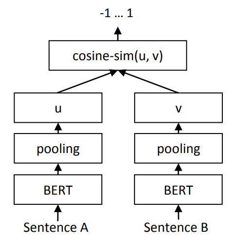
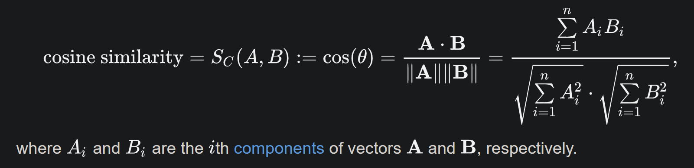
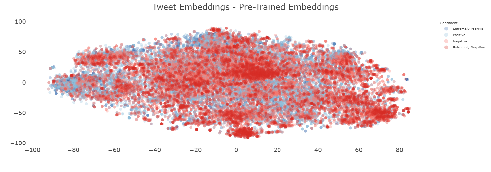
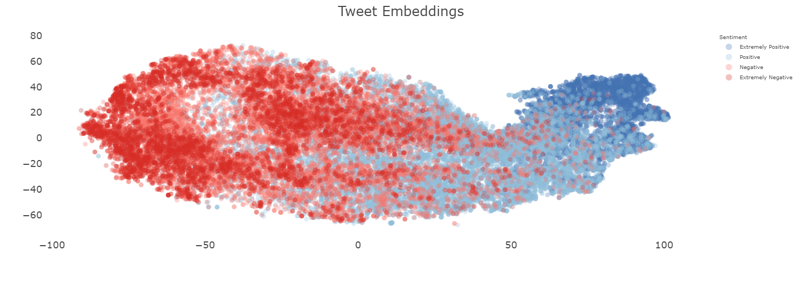

# APS 2

## 1. Encontrando embeddings

### 1.1 Dataset 

O dataset utilizado foi o [Coronavirus tweets NLP - Text Classification](https://www.kaggle.com/datasets/datatattle/covid-19-nlp-text-classification?select=Corona_NLP_train.csv) que contém tweets relacionados ao COVID-19. Os tweets foram classificados em 5 categorias: Extremely Negative, Negative, Neutral, Positive e Extremely Positive. Foram utilizadas as colunas OriginalTweet, com o texto do tweet, e Sentiment, com a classificação do tweet.

### 1.2 Processo para gerar embeddings

Para gerar os embeddings, foi utilizado o modelo pré-treinado `sentence-transformers/all-MiniLM-L6-v2` do [Hugging Face](https://huggingface.co/sentence-transformers/all-MiniLM-L6-v2), um modelo do tipo `Sentence Transformer` ou `[sBERT](https://sbert.net)`. O sBERT utiliza uma [rede neural siamesa](https://en.wikipedia.org/wiki/Siamese_neural_network), que consiste em, dois BERts idênticos, compartilhando os mesmos pesos, que recebem duas sentenças como entrada, passam por uma camada de pooling, utilizando a média, e por fim, para identificar similaridade entre as sentenças, é utilizada a [similaridade por cosseno](https://en.wikipedia.org/wiki/Cosine_similarity), como pode ser visto na figura 1. Os hiperparâmetros utilizados foram os padrões do modelo, que podem ser visto no [paper](https://arxiv.org/abs/1908.10084), sendo eles: `learning_rate=2e-5, batch_size=16, optimizer=Adam e linear learning rate warm-up=10% dos dados de treinamento`.

<table>
  <tr>
   <td align="center"> <b>Fonte: Sentence-BERT: Sentence Embeddings using Siamese BERT-Networks</b></a>  Figura 1 - topologia sBERT</td>
  </tr>
</table>

### 1.3 Processo de treinamento

Para o processo de treinamento os dados foram divididos em 4 dataframes: extremamente negativo, negativo, positivo e extremamente positivo, os neutros foram desconsiderados. Após isso é criado um único dataset em que são passados dois tweets, sendo o primeiro um tweet positivo ou extremamente positivo e o segundo um tweet negativo ou extremamente negativo e seu índice de similaridade. Para tweets positivos e negativos o índice de similaridade é 0.3 e para tweets extremamente positivos e negativos o índice de similaridade é 0. A loss function utilizada foi a [CosineSimilarityLoss](https://www.sbert.net/docs/package_reference/sentence_transformer/losses.html#sentence_transformers.losses.CosineSimilarityLoss), ela recebe dois vetores de embeddings e calcula a similaridade por cosseno entre eles, pode ser vista na Equação 1. Ela foi utilizada pois o dataset foi criado com a ideia de ter tweets com ideias opostas entre si, então a loss function irá penalizar o modelo caso ele não consiga diferenciar os tweets.

<table>
  <tr>
   <td align="center"> <b>Fonte: Cosine similarity</b></a>  Equação 1 - Similaridade por cossenos</td>
  </tr>
</table>

## 2. Visualização dos embeddings

<table>
  <tr>
   <td align="center">  Figura 2 - Pretrained Embeddings</td>
   <td align="center">  Figura 3 - Tunned Embeddings</td>
  </tr>

</table>

Para a visualização dos embeddings foi utilizado o [TNSE](https://scikit-learn.org/stable/modules/generated/sklearn.manifold.TSNE.html), para reduzi-los para 2 dimensões. Na Figura 2 é possível ver os embeddings pré-treinados, onde os tweets estão bem distribuídos, porém não é possível ver uma separação clara entre as classes. Já na Figura 3, que foi aprimorada para essa tarefa, utilizando o treinamento descrito acima, é possível notar uma diferença mais clara entre as classes. É possível notar que os tweets extremamente positivos estão bem pro extremo, enquando os extremamente negativos, embora não tanto para o extremo quanto o extremamente positivo, estão mais para o lado oposto, mostrando uma clusterização entre as classes de tweets.

