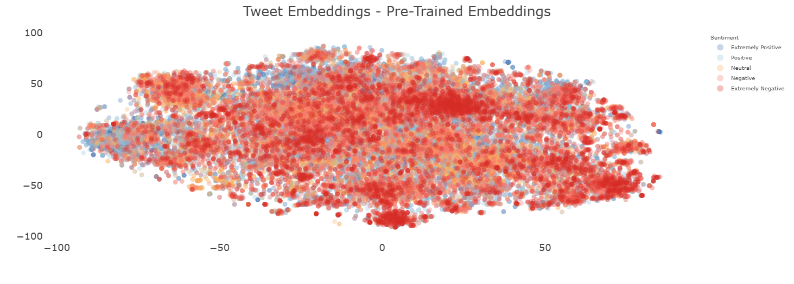
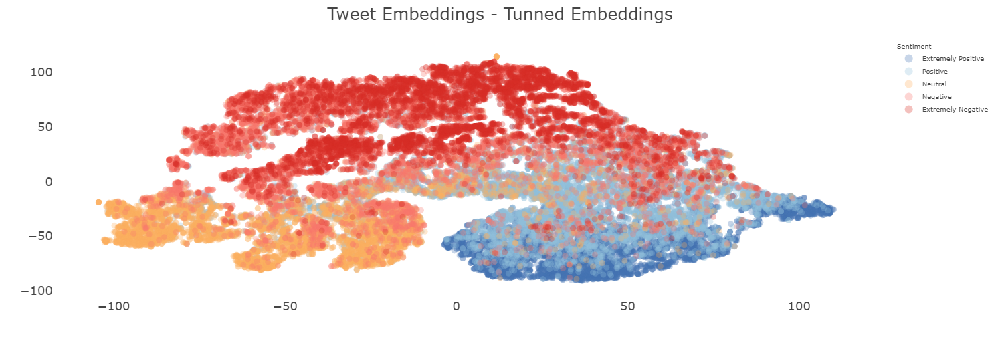

# APS 2

## Sumário
- [APS 2](#aps-2)
  - [Sumário](#sumário)
  - [0. Dependências](#0-dependências)
  - [1. Encontrando embeddings](#1-encontrando-embeddings)
    - [1.1 Dataset](#11-dataset)
    - [1.2 Processo para gerar embeddings](#12-processo-para-gerar-embeddings)
    - [1.3 Processo de treinamento](#13-processo-de-treinamento)
  - [2. Visualização dos embeddings](#2-visualização-dos-embeddings)
  - [3. Sistema de busca](#3-sistema-de-busca)
    - [Teste que retorna 10 tweets](#teste-que-retorna-10-tweets)
    - [Teste que retorna mais que 1 e menos que 10 tweets](#teste-que-retorna-mais-que-1-e-menos-que-10-tweets)
    - [Teste que retorna algo não óbvio](#teste-que-retorna-algo-não-óbvio)
  - [4. Hugging Face](#4-hugging-face)
  - [5. Referências](#5-referências)


## 0. Dependências
```bash
pip install -r requirements.txt
```

## 1. Encontrando embeddings

> [!NOTE]
> O código para essa etapa está em `notebook.ipynb` 
 
### 1.1 Dataset 

O dataset utilizado foi o [Coronavirus tweets NLP - Text Classification](https://www.kaggle.com/datasets/datatattle/covid-19-nlp-text-classification?select=Corona_NLP_train.csv) que contém tweets relacionados ao COVID-19. Os tweets foram classificados em 5 categorias: Extremely Negative, Negative, Neutral, Positive e Extremely Positive. Foram utilizadas as colunas OriginalTweet, com o texto do tweet, e Sentiment, com a classificação do tweet.

### 1.2 Processo para gerar embeddings

Para gerar os embeddings, foi utilizado o modelo pré-treinado `sentence-transformers/all-MiniLM-L6-v2` do [Hugging Face](https://huggingface.co/sentence-transformers/all-MiniLM-L6-v2), um modelo do tipo `Sentence Transformer` ou [sBERT](https://sbert.net). O sBERT utiliza uma [rede neural siamesa](https://en.wikipedia.org/wiki/Siamese_neural_network), que consiste em, dois BERts idênticos, compartilhando os mesmos pesos, que recebem duas sentenças como entrada, passam por uma camada de pooling, utilizando a média, e por fim, para identificar similaridade entre as sentenças, é utilizada a [similaridade por cosseno](https://en.wikipedia.org/wiki/Cosine_similarity), como pode ser visto na figura 1. Os hiperparâmetros utilizados foram os padrões do modelo, que podem ser encontrados em: [hiperparâmetros](https://huggingface.co/gianvr/sbert-tunned-covid#all-hyperparameters).

<div align="center" style="max-width:68rem;">
<table>
  <tr>
   <td align="center"><a href="https://arxiv.org/abs/1908.10084"><br /><sub><b>Fonte: Sentence-BERT: Sentence Embeddings using Siamese BERT-Networks</b></sub></a><br /><a href="https://arxiv.org/abs/1908.10084" title="Sentence-BERT: Sentence Embeddings using Siamese BERT-Networks"></a> Figura 1 - topologia sBERT</td>
  </tr>
</table>
</div>


### 1.3 Processo de treinamento

Para o processo de treinamento foram criados pares de tweets de diferentes sentimentos, podendo ser combinações de extremamente positivos, positivos, neutros, negativos e extremamente negativos, após a criação dos pares o dataset foi embaralhado e utilizado 25% dele para acelerar o treinamento. Cada par foi dado um valor que representa sua similaridade, sendo 0 para os extremos, 0.7 para sentimentos similares, 0.2 para sentimentos extremos, sentimentos opostos não extremos e neutros e 0.5 para sentimentos neutros e não extremos. A loss function utilizada foi a [CosineSimilarityLoss](https://www.sbert.net/docs/package_reference/sentence_transformer/losses.html#sentence_transformers.losses.CosineSimilarityLoss), ela recebe dois vetores de embeddings e calcula a similaridade por cosseno entre eles, pode ser vista na Equação 1, sendo que para comparar o valor de saída com o label da entrada utiliza-se o MSE. Ela foi utilizada pois o experimento consiste em agrupar tweets de sentimentos similares e separar tweets de sentimentos diferentes, e ao definir esses valores manualmente, a loss function foi utilizada para otimizar os embeddings para essa tarefa.

<div align="center" style="max-width:68rem;">
<table>
  <tr>
   <td align="center"><a href="https://en.wikipedia.org/wiki/Cosine_similarity"><br /><sub><b>Fonte: Cosine similarity</b></sub></a><br /><a href="https://en.wikipedia.org/wiki/Cosine_similarity" title="Cosine similarity"></a> Equação 1 - Similaridade por cossenos</td>
  </tr>
</table>
</div>

## 2. Visualização dos embeddings

> [!NOTE]
> O código para essa etapa está em `notebook.ipynb`

<div align="center" style="max-width:68rem;">
<table>
  <tr>
   <td align="center"><br /><sub> Figura 2 - Pretrained Embeddings</td>
   <td align="center"><br /><sub> Figura 3 - Tunned Embeddings</td>
  </tr>

</table>
</div>

Para a visualização dos embeddings foi utilizado o [TNSE](https://scikit-learn.org/stable/modules/generated/sklearn.manifold.TSNE.html), para reduzi-los para 2 dimensões. Na Figura 2 é possível ver os embeddings pré-treinados, onde os tweets estão bem distribuídos, porém não é possível ver uma separação entre os sentimentos. Já na Figura 3, é possível ver os embeddings agrupados por seus sentimentos, nela é possível notar 3 clusters, um para sentimentos positivos, um para sentimentos negativos e um para sentimentos neutros. Sendo que é notório uma consistência maior no cluster de sentimentos positivos, enquanto principalmente o cluster de sentimentos neutros ocorre uma quebra, em que não a continuidade dos tweets.

Embora ocorra uma menor consistência no cluster de sentimentos neutros, e negativos, comparada ao cluster de sentimentos positivos, ainda assim é possível notar que cada sentimento está para um lado do gráfico. Os sentimentos positivos estão mais a direita, os sentimentos neutros mais para a esquerda e os sentimentos negativos mais para cima. Com isso o modelo foi capaz de gerar embeddings que agrupam por sentimentos. 

## 3. Sistema de busca

> [!NOTE]
> O código para essa etapa está em `src/get_recommendation.py`, e os testes em: `test/test_query.py`. Também é possível executar por `python src/get_recomendation.py "SUA_QUERY"`

### Teste que retorna 10 tweets

Query:
```
covid is a hoax
```

pytest:
```bash
pytest test/test_query.py::test_query_yields_10_results
```

### Teste que retorna mais que 1 e menos que 10 tweets

Query:
```
covid and h1n1
```

pytest:
```bash
pytest test/test_query.py::test_query_yields_few_results
```

### Teste que retorna algo não óbvio

Query:
```
public transport
```

pytest:
```bash
pytest test/test_query.py::test_query_yields_non_obvious_results
```


## 4. Hugging Face

O modelo pode ser encontrado em: https://huggingface.co/gianvr/sbert-tunned-covid

## 5. Referências

- [SBERT: How to Use Sentence Embeddings to Solve Real-World Problems](https://anirbansen2709.medium.com/sbert-how-to-use-sentence-embeddings-to-solve-real-world-problems-f950aa300c72)
- [Coronavirus tweets NLP - Text Classification](https://www.kaggle.com/datasets/datatattle/covid-19-nlp-text-classification?select=Corona_NLP_train.csv)
- [all-MiniLM-L6-v2](https://huggingface.co/sentence-transformers/all-MiniLM-L6-v2)
- [Siamese neural network](https://en.wikipedia.org/wiki/Siamese_neural_network)
- [sBERT](https://sbert.net)
- [Cosine similarity](https://en.wikipedia.org/wiki/Cosine_similarity)
- [CosineSimilarityLoss](https://www.sbert.net/docs/package_reference/sentence_transformer/losses.html#sentence_transformers.losses.CosineSimilarityLoss)
- [Sentence-BERT: Sentence Embeddings using Siamese BERT-Networks](https://arxiv.org/abs/1908.10084)
- [TNSE](https://scikit-learn.org/stable/modules/generated/sklearn.manifold.TSNE.html)
